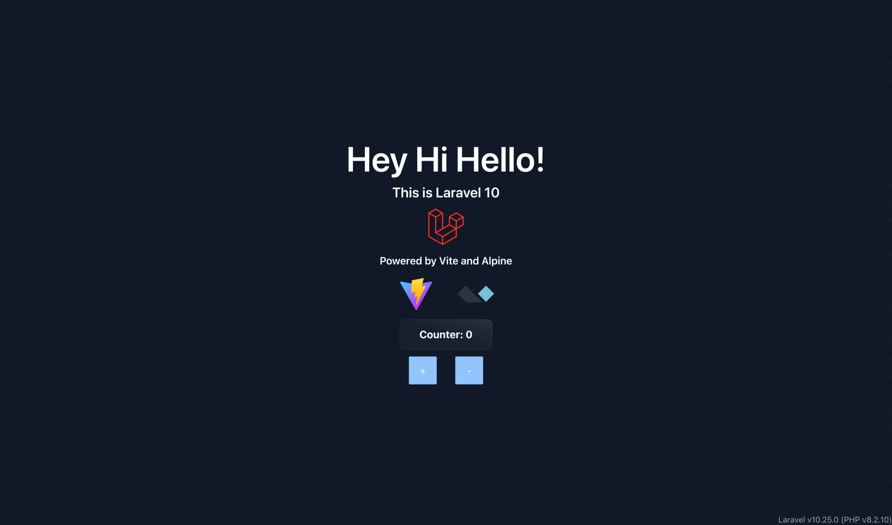

# Proyecto con Laravel 10

## Instalación

Para la instalación de este proyecto es necesario contar con PHP instalado y su gestor de paquetes Composer.

La instalación de PHP varía por sistema operativo, incluso en entre Macos y Linux. En Windows es un poco más sencillo y hay más tutoriales que puedan ayudarte a su instalación.

De la misma manera Composer, el gestor de paquetes de PHP, debe instalarse para poder ejecturar los comandos que te permitirán levantar este proyecto de manera local.

Como recomendación, instala PHP en su versión 8.2.10 o al menos superior a la 8; y Composer en su versión 2.5.5.

Para comprobar que se encuentran instalados puedes probar los siguientes comandos en una consola o terminal:

```sh
php -v
```

La cual te dara una salida similar a:

```sh
PHP 8.2.10 (cli) (built: Aug 31 2023 18:52:55) (NTS)
Copyright (c) The PHP Group
Zend Engine v4.2.10, Copyright (c) Zend Technologies
    with Zend OPcache v8.2.10, Copyright (c), by Zend Technologies
```
Y el siguiente comando sería:
```sh
composer
```
Que en un principio, te entregaría una salida de consola similar a esta y luego una serie de comandos para su uso.
```sh
   ______
  / ____/___  ____ ___  ____  ____  ________  _____
 / /   / __ \/ __ `__ \/ __ \/ __ \/ ___/ _ \/ ___/
/ /___/ /_/ / / / / / / /_/ / /_/ (__  )  __/ /
\____/\____/_/ /_/ /_/ .___/\____/____/\___/_/
                    /_/
Composer version 2.5.5 2023-03-21 11:50:05
```

## Ejecución

Una vez instaladas las herramientas, puedes probar hacer uso del siguiente comando en una terminal desde la raíz de la carpeta del proyecto.

```sh
php artisan serve
```

Esto debería entregarte una salida que te indique una dirección local en la cuál se ha levantado un servidor de desarrollo para poder trabajar en la aplicación.

Para poder hacer uso de las dependencias de Frontend, debemos ejecutar el siguiente comando:

```sh
npm run dev
```

Una vez tengamos estos comandos ejectuándose, abrimos la dirección que nos otorgó el comando ```php artisan serve```, o la copias y pegas en tu navegador y listo, manos a la obra.

## Galería

